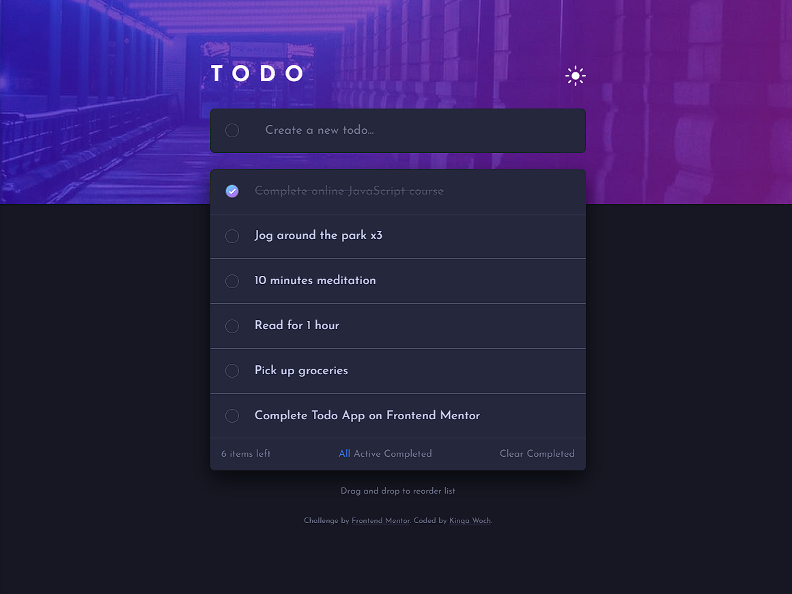
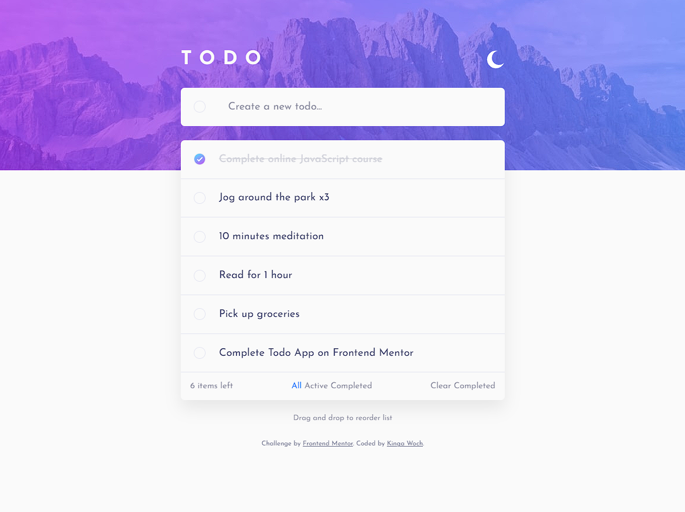
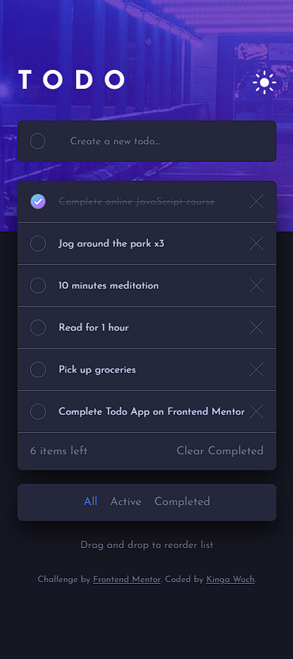

# Frontend Mentor - Todo app solution

This is a solution to the [Todo app challenge on Frontend Mentor](https://www.frontendmentor.io/challenges/todo-app-Su1_KokOW). Frontend Mentor challenges help you improve your coding skills by building realistic projects.

## Table of contents

- [Overview](#overview)
  - [The challenge](#the-challenge)
  - [Screenshot](#screenshot)
  - [Links](#links)
- [My process](#my-process)
  - [Built with](#built-with)
  - [Useful resources](#useful-resources)
- [Author](#author)

## Overview

### The challenge

Users should be able to:

- View the optimal layout for the app depending on their device's screen size
- See hover states for all interactive elements on the page
- Add new todos to the list
- Mark todos as complete
- Delete todos from the list
- Filter by all/active/complete todos
- Clear all completed todos
- Toggle light and dark mode
- **Bonus**: Drag and drop to reorder items on the list

### Screenshot

### Links

- Live Site URL: [Live Site at Netlify](https://todo-app-kw.netlify.app/)

## My process

### Built with

- Semantic HTML5 markup
- CSS custom properties
- Flexbox
- CSS Grid
- TypeScript

### Useful resources

- [Web Dev Simplified](https://www.youtube.com/watch?v=jfYWwQrtzzY) - This video helped me build a sortable drag and drop list.
- [Jak zacząć programować - Typescript - kurs podstaw](https://www.youtube.com/watch?v=5CBZ6DymX0Y&t=1554s) - This tutorial allowed me to take my first steps in Typescript.

## Author

- Website - [Kinga Woch](https://kinga-woch.netlify.app)
- Github - [Kinga Woch](https://github.com/KingaWoch)
- Frontend Mentor - [@KingaWoch](https://www.frontendmentor.io/profile/KingaWoch)
